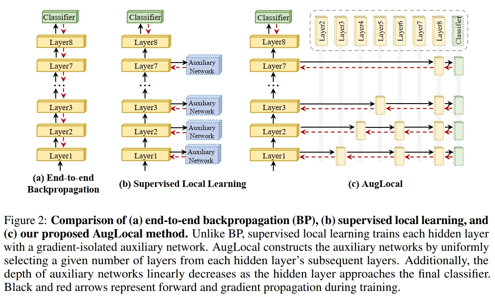

# AugLocal
This repo contains the PyTorch implementation of the paper: Scaling Supervised Local Learning with Augmented Auxiliary Networks. (ICLR 2024). [[OpenReview](https://openreview.net/forum?id=Qbf1hy8b7m)]

<p align="center">
    
</p>

## Usage
### Dependencies
- python 3.8.15
- pytorch 1.13.1
- torchvision 0.14.1


### Scripts

- Train ResNet32 with AugLocal on CIFAR10:
```bash
python train.py --dataset cifar10 --model resnet --layers 32 --cos_lr --local_module_num 16 --epochs 400  --batch_size 1024 --rule AugLocal --aux_net_depth 2 --pyramid --pyramid_coeff 0.5
```

- Train ResNet110 with AugLocal on CIFAR10:

```bash
python train.py --dataset cifar10 --model resnet --layers 110 --cos_lr --local_module_num 55 --epochs 400  --batch_size 1024 --rule AugLocal --aux_net_depth 3 --pyramid --pyramid_coeff 0.5
```

Please refer to `run.sh` for the scripts of all supervised local learning rules.

## Acknowledgement

Our implementation is adapted from [InfoPro](https://github.com/blackfeather-wang/InfoPro-Pytorch). We thank the authors for releasing their code.

## Contact
If you have any questions, please contact <chenxiang.ma@connect.polyu.hk>. 

